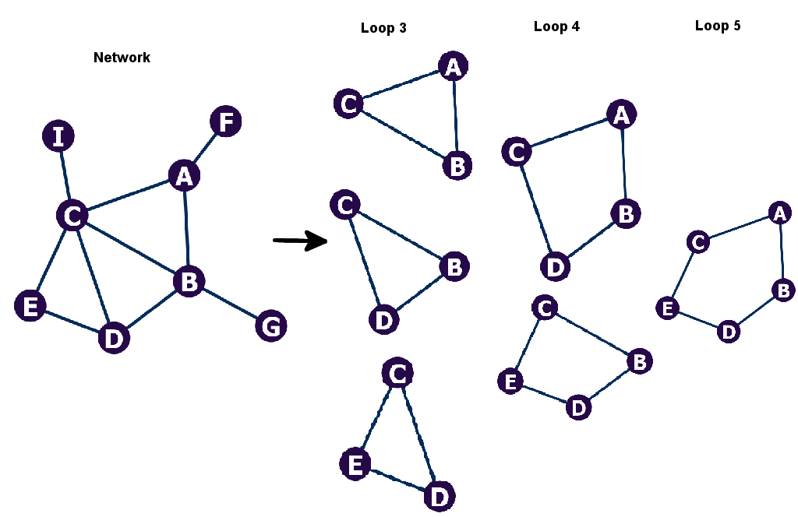

Short loops are defined in [Chung *et al.*, 2015](https://www.nature.com/articles/srep08540#article-info)

## In the files, each line has a set of 3 proteins making a short loop interaction:

A,B,C 

B,C,D

...

